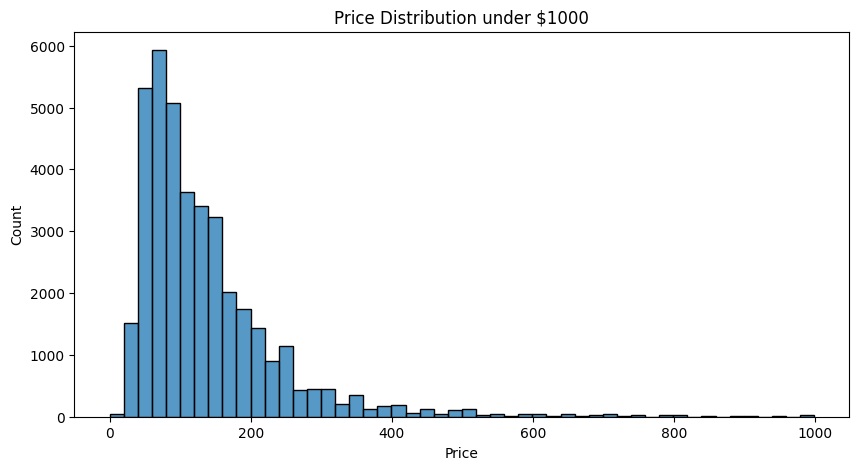
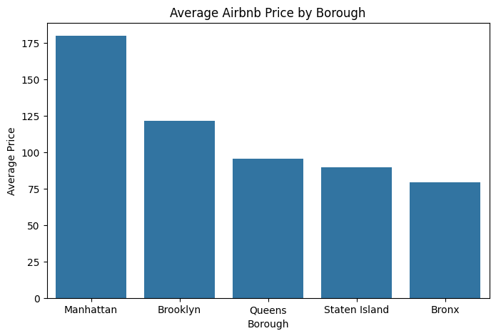
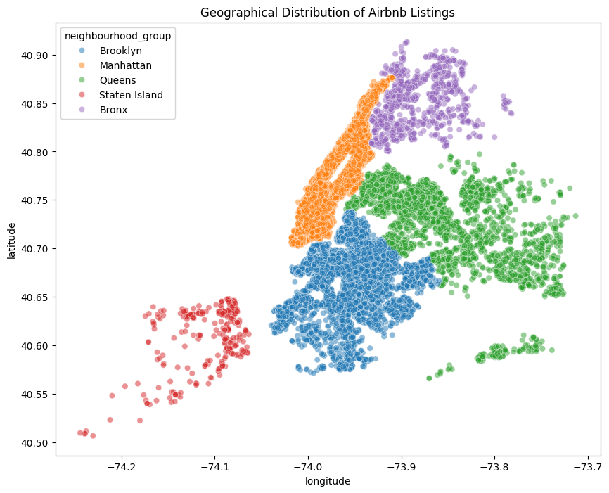

# Airbnb NYC Data Analysis

## Project Overview

This project performs Exploratory Data Analysis (EDA) on the Airbnb NYC 2019 dataset using Python. The objective of the project is to analyze Airbnb listings across different boroughs of New York City and identify trends related to pricing, availability, room types, customer engagement, and geographical distribution.

The project demonstrates how data analytics techniques can be used to extract meaningful business insights from real-world datasets.

## Objectives

- Understand the structure and characteristics of the Airbnb NYC dataset
- Perform data cleaning and preprocessing
- Analyze pricing trends across boroughs
- Explore room type distribution and customer preferences
- Identify highly active hosts and listing concentrations
- Visualize geographical distribution of Airbnb listings
- Generate insights using exploratory data analysis techniques


## Technologies Used

- Python
- Pandas
- NumPy
- Matplotlib
- Seaborn
- Jupyter Notebook

## Dataset Information

The dataset used in this project is the **Airbnb NYC 2019 Dataset**, which contains information about Airbnb listings in New York City, including:

- Listing name
- Host details
- Borough and neighbourhood
- Room type
- Price
- Number of reviews
- Availability
- Latitude and longitude

## Exploratory Data Analysis Performed

The project includes analysis and visualization of:

- Price distribution
- Borough-wise pricing trends
- Listing distribution across boroughs
- Room type analysis
- Customer engagement analysis
- Host activity analysis
- Geographical distribution of listings
- Availability analysis
- Minimum nights analysis
- Correlation heatmap


## Key Findings

- Most Airbnb listings are concentrated within lower and moderate price ranges.
- Manhattan has the highest average Airbnb prices.
- Manhattan and Brooklyn contain the largest number of Airbnb listings.
- Entire home/apartment is the most common and expensive room type.
- Several hosts manage multiple listings, indicating professional hosting activity.
- Airbnb listings are densely concentrated in major urban regions.
- Most properties require short minimum stays, reflecting short-term accommodation trends.


## Conclusion

This project demonstrates the complete workflow of exploratory data analysis, including data cleaning, visualization, and insight generation using Python. The analysis highlights how location, room type, and availability influence Airbnb listing behavior across New York City.


## Sample Visualizations

### Price Distribution


### Average Airbnb Price by Borough


### Geographical Distribution of Airbnb Listings
   

## How to Run the Project

1. Clone the repository
2. Open the project folder
3. Install required libraries

```bash
pip install pandas numpy matplotlib seaborn notebook